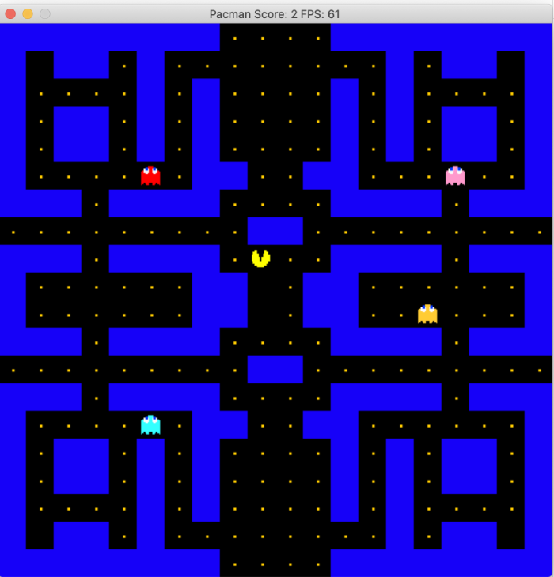

# CppND-pacman
This project is based on the original 2D Pac-Man game. The game is programmed in C++ using the SDL2 library.

Just like the original game, the goal is to get all the food (small dots) without getting caught by one of the ghosts. 
You can navigate using the arrow keys.

Sources:

* The initial game setup is based on https://github.com/udacity/CppND-Capstone-Snake-Game
* Pacman sprites are based on the sprites from Google's version of the Pac-Man game: http://blogoscoped.com/archive/2010-05-22-n54.html
* (and useful tutorial to get the sprites: https://www.programmersranch.com/2014/03/sdl2-animations-with-sprite-sheets.html?m=1)

## Dependencies for Running Locally
* cmake >= 3.7
  * All OSes: [click here for installation instructions](https://cmake.org/install/)
* make >= 4.1 (Linux, Mac), 3.81 (Windows)
  * Linux: make is installed by default on most Linux distros
  * Mac: [install Xcode command line tools to get make](https://developer.apple.com/xcode/features/)
  * Windows: [Click here for installation instructions](http://gnuwin32.sourceforge.net/packages/make.htm)
* SDL2 >= 2.0
  * All installation instructions can be found [here](https://wiki.libsdl.org/Installation)
  * Note that for Linux, an `apt` or `apt-get` installation is preferred to building from source.
* SDL2_image >= 2.0
  * All installation instructions can be found [here](https://www.libsdl.org/projects/SDL_image/) or [here](https://lazyfoo.net/tutorials/SDL/06_extension_libraries_and_loading_other_image_formats/linux/index.php)
  * Note that for Linux, an apt or apt-get installation is preferred to building from source.
* gcc/g++ >= 5.4
  * Linux: gcc / g++ is installed by default on most Linux distros
  * Mac: same deal as make - [install Xcode command line tools](https://developer.apple.com/xcode/features/)
  * Windows: recommend using [MinGW](http://www.mingw.org/)

## Basic Build Instructions

1. Clone this repo.
2. Make a build directory in the top-level directory: `mkdir build && cd build`
3. Compile: `cmake .. && make`
4. Run it: `./PacMan`.

## Level structure

The assets directory contains all the graphics and the levels.
It is possible to create custom levels by changing the `level-1.txt`.

The level needs to consist of a 20x20 grid and the following characters can be used:
* `#` indicates a wall
* `P` indicates where Pacman will start (there can only be one. If multiple are defined, the last read position will be used)
* `G` indicated the start position of a ghost. There can maximum be 4.
* `_` indicates food for Pac-Man to catch.

If a gap is left at the edge of the map, it must also be there on the mirrored-side, as it allows you or the ghosts to "teleport" to the other side of the map.

## Code structure

The code consists of several classes:
* `Controller`: Handles the input of the user.
* `Renderer`: Draws everything to the screen.
* `Main`: creates a renderer, controller and game object.
* `Actor`: Every moving item on the screen, either controlled by the computer or by a player is an actor (e.g. ghosts and pac-man)
* `Pacman`: The main player class. This takes care of the correct sprite coordinates.
* `Ghost`: This takes care of the correct sprite coordinates and calculates the next moves based on the position of pacman. Each ghost has a different level of "intelligence".
* `Utilities`: Just some utilities, in this case an operator overload to compare two SDL_Points.
* `Grid`: A wrapper class to easily add and access walls.
* `Game`: Reads out the level and creates `Grid`, Pacman and Ghost objects. The `Ghost` objects are a vector of unique pointers. The food is keps as a vector of `SDL_Point`s. All together they represent the game's state.

1. To begin, `main` creates a `Controller`, a `Game`, and a `Renderer` object.
2. On initialisation, `Game` will read out the level and stores a `Pacman`, `Grid` and `Ghost` objects as part of the state.
3. `main` calls `Game::Run` to start the game loop

## Capstone project rubic points

* Loops, Functions, I/O
  * Variety of control structures and organised in functions (see explanation above)
  * The program reads from a file -> the level is read from a file in `Game::ReadLevelFromFile`
  * User input -> Controller class
* Object Oriented Programming
  * The project uses Object Oriented Programming techniques. -> devided into classes etc. See explanation in [Code Structure](#code-structure).
  * Classes use appropriate access -> All  data members are explicitly specified as public, protected or private.
  * Derived class functions override virtual base class functions. -> `Actor` is the base class with `Ghost` and `Pacman` as derived classes.
* Memory Management
  * Pass-by-reference used in Actor and derived classes
  * Smart pointers (`unique_ptr`) used to reference the `Ghosts` in `Game`
* Concurrency
  * The project uses multithreading. -> next move selection of `Ghost`
  * A promise and future is used in the project. -> Also in next move selection of `Ghost` (called from `Game`)
